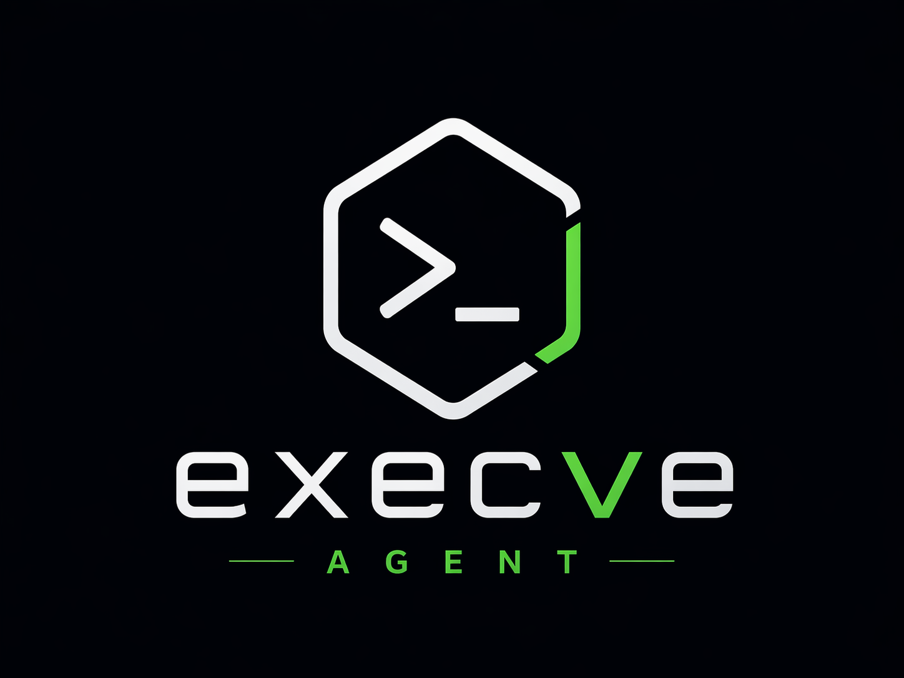

# execve agent

<p align="center">
  
</p>

Local-first coding agent stack for VS Code with a deterministic Go runtime,
local model provider adapters, and a dedicated Studio experience.

## Repository Layout

- `extension/`: VS Code extension frontend (TypeScript)
- `runtime/`: deterministic Go agent runtime
- `api/`: shared request/response schema artifacts
- `docs/`: project docs and workflow notes
- `prompts/`: agent/tool/parsing prompt stack for local model orchestration
- `asssets/`: logo and visual assets

## Quick Start

1. Start the runtime:

   ```bash
   cd runtime
   go run ./cmd/agentd
   ```

   Provider selection is environment-driven:

   ```bash
   # Mock provider (default)
   AGENT_PROVIDER=mock go run ./cmd/agentd

   # Ollama
   AGENT_ALLOW_COMMANDS=true AGENT_PROVIDER=ollama OLLAMA_MODEL=llama3.2:3b go run ./cmd/agentd

   # LM Studio (OpenAI-compatible endpoint)
   AGENT_ALLOW_COMMANDS=true AGENT_PROVIDER=lmstudio LMSTUDIO_MODEL=local-model go run ./cmd/agentd
   ```

   Optional provider endpoint overrides:

   - `OLLAMA_BASE_URL` (default `http://127.0.0.1:11434`)
   - `LMSTUDIO_BASE_URL` (default `http://127.0.0.1:1234`)

2. Build the extension:

   ```bash
   cd extension
   npm install
   npm run build
   ```

3. Launch the extension host from VS Code and run command:

   - `Local Agent: Open Studio`
   - `Local Agent: New Conversation`
   - `Local Agent: Focus Input`
   - `Local Agent: Continue Command Output`
   - `Local Agent: Stop Running Command`
   - `Local Agent: Open Latest Diff`
   - `Local Agent: Accept Latest Diff`
   - `Local Agent: Reject Latest Diff`
   - `Local Agent: Insert Active Symbol Context`
   - `Local Agent: Insert Git Diff Context`
   - `Local Agent: Insert Failing Tests Context`
   - `Local Agent: Start Agent Session`
   - `Local Agent: Start Chat Session`

## Documentation

- [Documentation Index](docs/README.md)
- [Getting Started](docs/getting-started.md)
- [Prompt Architecture](docs/architecture/prompt-architecture.md)

## Community And Governance

- [Contributing Guide](CONTRIBUTING.md)
- [Issue Templates](.github/ISSUE_TEMPLATE)
- [Code of Conduct](CODE_OF_CONDUCT.md)
- [Security Policy](SECURITY.md)
- [Changelog](CHANGELOG.md)
- [License](LICENSE)

## Current Scope

- Deterministic request/plan/response loop
- Dedicated Studio webview for contextual prompting, stream rendering, and tool traces
- Collapsible tool-trace cards with payload preview and one-click copy
- In-memory diff stream with truncated structured diffs rendered in Studio and diff editor preview
- Diff accept/reject flow for latest snapshot (stage or revert tracked/untracked files)
- Workspace-scoped Studio conversation persistence across reloads
- Workspace Timeline integration for file-level change snapshots
- Composer context insertion shortcuts for active symbol, git diff, and failing tests
- In-Studio approval mode picker (`defaultApproval`, `bypassApproval`, `autopilot`)
- Explicit continue/stop command controls in Studio and command palette
- One-click agent vs chat session commands in VS Code
- Local HTTP bridge from extension to runtime
- Streaming runtime responses to extension via SSE
- Real provider integration for Ollama and LM Studio
- Runtime tool registry with `read_file`, `search_code`, `git_diff`, and `create_file`
- Runtime command execution via `execute_command` with pooled terminals, line-event streaming, continuation cursors, and partial output tracking
- Permission modes (`defaultApproval`, `bypassApproval`, `autopilot`) with customizable command and MCP allow/block policies
- Deterministic command output capture to markdown file for command+file prompts
- Prompt bundle loading from `prompts/` into provider context

## Prompt Library

Use the prompt stack under `prompts/` for higher quality local-agent behavior:

- `prompts/agents/`: role-level system prompts (main/planner/file-editor)
- `prompts/tools/`: tool-call format and catalog
- `prompts/parsing/`: language parsing and file-modification policy
- `prompts/templates/`: reusable user task templates

## Suggested Next Steps

1. Add provider auto-discovery and model listing endpoints.
2. Add diff-based file editing tools and approval flow.
3. Add integration tests for runtime API stream events and provider adapters.
4. Add webview chat UI for richer streamed rendering and tool traces.
